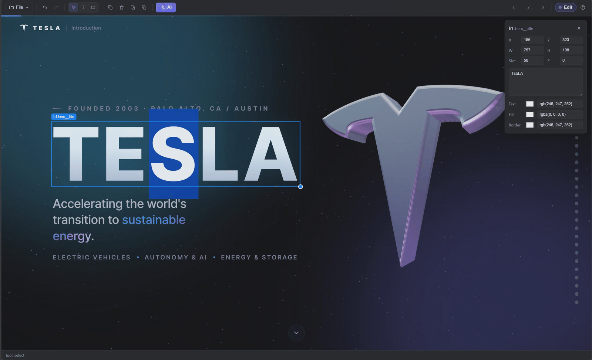

<div align="center">

# 🪄 Slidesmith

**The AI-assisted editor for refining AI-generated HTML presentations.**

Point it at a deck an LLM generated as static HTML/CSS/JS, then click, drag, restyle, and re-prompt to micro-edit it — **without ever touching the markup, and without breaking the deck's own styles, scripts, or animations.**


<!-- Overview: the editor working on a live AI-generated deck — title selected, inspector open. -->


</div>

---

## See it in action

The deck on the left is a complete, self-contained HTML presentation an AI wrote — gradients, a live Three.js logo, scroll-triggered animations and all. Slidesmith renders it **live** and lets you edit it like PowerPoint: select the title, nudge it, recolor it, or just ask the AI to "make it more premium" — and the deck's own code keeps running untouched.


> ▶️ This is a short, looping highlight. **[Watch the full demo in HD (MP4, 2.4 MB)](docs/slidesmith-demo.mp4)** for the complete walkthrough.

## The big idea — harness the AI, don't trust it with your HTML

AI tools are great at generating an entire slide deck as one static HTML file. But the moment you want to *change* something, you're back to diving into machine-written code, hoping you don't break a keyframe or a closing tag.

Slidesmith's whole design is one invariant:

> **The AI never emits HTML, CSS, or JS. Ever.**

Instead, every edit — whether you made it with the mouse or the AI made it from a sentence — flows through **one safe path** and comes out as a small, **validated JSON patch** with a fixed, known set of properties (`x, y, w, h, fontSize, color, backgroundColor, …`). That patch is sanitized **server-side and again client-side** before a single value reaches the DOM. Unknown keys, unsafe values, and anything off-contract are silently dropped — the gate never throws, it just refuses.

That's the "true power": you get the fluency of natural-language editing **without** ever handing a language model write-access to your markup. The result is structurally impossible to corrupt — the worst a bad AI response can do is produce *no* change.

**Why the deck never breaks:**

- **Never reparents elements, never overwrites `transform`.** Decks animate with `transform`/opacity transitions and `.in-view` classes. Moving an object only adjusts `left`/`top`, so scroll animations and 3D scenes keep working.
- **Text edits rewrite text *nodes*, not `innerHTML`.** Editing a heading preserves nested `<strong>`, `<span>`, `<cite>` — no re-serialization, no lost listeners.
- **Selection is non-destructive.** A click only highlights; the DOM isn't mutated until you actually drag.
- **The deck's CSS/JS stay authoritative.** The editor only ever writes inline `style="…"` (and text). It never edits the deck's stylesheets or scripts — they stay loaded and in charge.
- **Exports are clean.** `getCleanHtml()` strips every editor artifact, so a saved deck is byte-for-byte a normal presentation again.

## Features

- 🎯 **Direct manipulation** — click to select, drag to move, handle to resize, double-click to edit text. Works on arbitrary AI-generated boxes/cards/titles, not just known templates.
- 🤖 **AI Edit (chat)** — select an object, describe a change in plain language (English **or** Korean), and the AI returns a validated patch applied live. Multi-turn chat to keep refining.
- 🧱 **AI actions, still no HTML** — beyond single-property patches, the AI can **arrange** objects (align / distribute / stack / grid / snap) and **insert vetted content blocks** (callout, stat card, bullet, quote, label chip) — all by naming verbs and filling text slots, never by authoring markup.
- 🎞️ **Animation presets** — apply curated entrance/emphasis animations (`fadeIn`, `fadeInUp`, `slideInLeft`, `zoomIn`, `pulse`, `float`, …) from a fixed menu. Each preset rests at a neutral final frame, so it never displaces a deck element.
- 🛡️ **Safe by design** — one validator (`validatePatch` / `validateActions`) is the only door to the DOM; the patch contract lives in a single shared module so it can't drift.
- ⌨️ **PowerPoint-style shortcuts** — copy/cut/paste, undo/redo, duplicate, delete, arrow-nudge, z-order, slide navigation.
- 💾 **Save & export** — overwrite the HTML in place, export just the HTML, or export the whole project folder (CSS/JS/assets copied).
- 🧪 **Mock AI mode** — runs with **zero secrets** when no API key is set, returning deterministic patches so the full flow is testable offline.

## Quick start

Requires **Node.js 18+**. For folder loading and save-in-place, use a **Chromium browser** (Chrome/Edge).

```bash
npm install
npm run dev
```

Then open **http://localhost:5173**.

> Prefer clicking ▶ in your IDE? Run **`main.py`** — it installs deps if needed, starts the dev server, and opens your browser automatically.

`npm run dev` also serves the AI endpoint in-process, so **AI Edit works in dev with no separate backend** (mock mode until you add an API key).

## Usage

1. **Load a deck** — *Open Folder* (Chromium) and pick a folder containing `index.html` + assets, or *Open Files…* (any browser) and multi-select the deck's files. Sample decks are included in [`sample_deck/`](sample_deck) (English Tesla deck + Korean deck).
2. **Edit** — with **Edit ON**, click an object to select it; the floating inspector (top-right) appears for position/size/text/colors. Drag to move, use the corner handle to resize, double-click to edit text. Click empty space to deselect.
3. **AI Edit** — select an object, click **AI**, and chat your request (e.g. *"make the title bigger"*, *"warm beige background, gold border"*, *"이 박스를 더 고급스럽게"*).
4. **Save / Export** — from the **File** menu: *Save HTML* (in place), *Export HTML Only*, or *Export Project* (full folder).

### Keyboard shortcuts

| Action | Shortcut |
| --- | --- |
| Undo / Redo | `Ctrl/⌘ Z` / `Ctrl/⌘ Y` (or `Ctrl/⌘ Shift Z`) |
| Copy / Cut / Paste | `Ctrl/⌘ C` / `X` / `V` |
| Duplicate | `Ctrl/⌘ D` |
| Delete | `Delete` / `Backspace` |
| Nudge selected (×10 with Shift) | Arrow keys |
| Bring to front / Send to back | `Ctrl/⌘ ]` / `Ctrl/⌘ [` |
| Next / previous slide | `Page Down` · `Space` / `Page Up` (arrows when nothing is selected) |
| Edit text / finish | Double-click / `Esc` |

(There's a **?** button in the toolbar with the full list.)

## AI setup

By default the app runs in **mock mode** (no key required). To use a real model, set these **server-side** env vars before `npm run dev` (the key is never shipped to the browser):

```bash
# PowerShell
$env:OPENAI_API_KEY="sk-..."
$env:HTML_PPT_AI_MODEL="gpt-4.1-mini"   # optional
npm run dev
```

| Variable | Purpose |
| --- | --- |
| `OPENAI_API_KEY` | Enables real API mode (mock mode if unset). |
| `HTML_PPT_AI_MODEL` | Model name (default `gpt-4.1-mini`). |
| `OPENAI_BASE_URL` | API base URL (default OpenAI). |
| `HTML_PPT_AI_TIMEOUT` | Request timeout in seconds (default 45). |

## How it works

The deck renders inside an isolated **same-origin `<iframe>`**, and a small editor bundle is injected into it. The React shell talks to the editor over `postMessage`. The AI request goes to a serverless function that holds the key and returns only a sanitized action envelope:

```
React shell ──postMessage──▶ editor (in iframe)  ── mutates deck DOM (inline styles + text nodes only)
     │                                  ▲
     └─ AI chat ─▶ /api/ai-edit ─▶ model ─▶ validate ─▶ safe {patch | layout | insertBlock} ─┘
```

The **patch/action contract** — the *only* things the AI can change — lives in one place, [`shared/`](shared), imported by the editor, the app, **and** the serverless function, so the trust boundary can never drift across consumers.

## Roadmap — the other half of the pipeline

Slidesmith is the **editing** stage. The upstream **generation** stage — a pipeline that turns plain text or an outline into a polished, self-contained HTML deck — is planned but **not yet built**. The two are designed to compose: generate a deck from text, then open it in Slidesmith to refine it by hand or by prompt. Slidesmith's "never break the deck's HTML" invariant is exactly what makes a generated deck safe to keep editing.

## Project structure

```
shared/         single source of truth — patch keys, JSON schema, validator, action/animation/block contracts
src/editor/     the editor injected into the deck iframe (built as a standalone IIFE)
src/types/      postMessage protocol + selection/context types
src/app/        React shell — Toolbar, Inspector, DeckFrame, AiChat, hooks, io, ai client
api/            serverless AI proxy (web-standard handler + shared core logic)
sample_deck/    example AI-generated decks to try
main.py         convenience launcher (starts the dev server + opens the browser)
docs/           architecture notes, demo video, and the overview image
```

## Build & deploy

```bash
npm run build      # type-check + production build → dist/
npm run typecheck  # tsc, no emit
```

- **App**: host `dist/` as static files anywhere.
- **AI function**: deploy `api/ai-edit.ts` to Vercel / Cloudflare / Netlify with the env vars above (it targets edge runtimes; wrap `handleAiEdit()` from `api/_handler.ts` for Node-only runtimes).

> The editor runs **inside the deck iframe**, so after changing anything in `src/editor/*` you must rebuild it (`npm run build:editor`) — Vite HMR doesn't cover the injected bundle.

## Known limitations

- CSS `url(...)` references inside a deck's stylesheets aren't yet rewritten to blob URLs (only `src`/`href` attributes are), so relative font/image refs in CSS may not resolve in the preview.
- *Save HTML* in place needs a folder opened via the directory picker (a browser permission grant); decks opened via file upload download instead.

## License

**Proprietary — All rights reserved.** © 2026 Jaewoong Hwang. This source is
made visible for reference only; no use, copying, modification, or distribution
is permitted without written permission. See [`LICENSE`](LICENSE). For licensing
inquiries, contact the owner.
</content>
</invoke>
